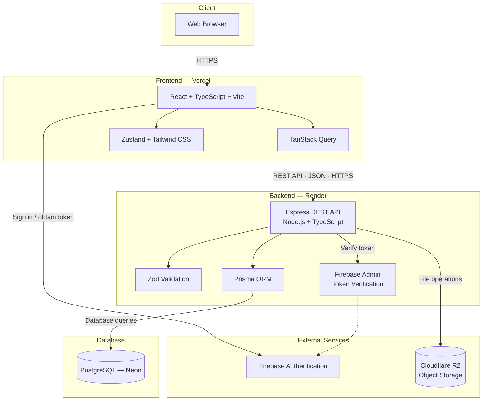

```mermaid

flowchart TB
    subgraph CLIENT["Client"]
        A["Web Browser"]
    end

    subgraph FRONTEND["Frontend — Vercel"]
        B["React + TypeScript + Vite"]
        C["TanStack Query"]
        D["Zustand + Tailwind CSS"]
    end

    subgraph BACKEND["Backend — Render"]
        E["Express REST API<br/>Node.js + TypeScript"]
        F["Zod Validation"]
        G["Prisma ORM"]
        H["Firebase Admin<br/>Token Verification"]
    end

    subgraph EXTERNAL["External Services"]
        I["Firebase Authentication"]
        J[("Cloudflare R2<br/>Object Storage")]
    end

    subgraph DATA["Database"]
        K[("PostgreSQL — Neon")]
    end

    A -->|HTTPS| B
    B --> C
    B --> D
    C -->|REST API · JSON · HTTPS| E
    E --> F
    E --> G
    G -->|Database queries| K
    B -->|Sign in / obtain token| I
    E -->|Verify token| H
    H -.-> I
    E -->|File operations| J
```
